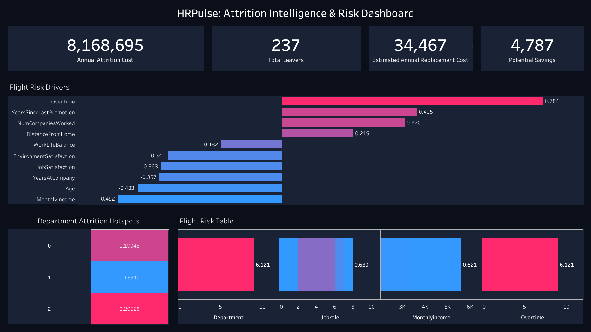

# HRPulse – Employee Attrition Analysis & Retention ROI Model

## Project Overview
Employee attrition is a significant, complex, and quantifiable business challenge. Replacing an employee incurs significant costs, from lost productivity and recruiting fees to onboarding delays. This project analyzes organizational HR data to uncover the primary drivers of turnover and models the financial impact of attrition. By identifying which employees are at the highest risk of leaving and understanding *why*, HR leadership can execute targeted, data-driven retention strategies to save millions in direct replacement costs.

## Analytical Approach
This project leverages exploratory data analysis (EDA) and a logistic regression predictive model to surface both high-level trends and individual-level risks. The methodology involves:
1. **Descriptive Analytics**: Assessing the baseline attrition rate and profiling the workforce to identify structural factors (e.g., department, income bands, overtime) that correlate with turnover.
2. **Predictive Analytics**: Using a regularized logistic regression model to isolate the strongest features driving attrition and to score each current employee with an estimated "flight risk" probability.
3. **Financial Modeling**: Applying a conservative industry standard (60% of annual salary) to convert raw turnover counts into a hard dollar cost to the business, framing retention as a direct ROI driver.

## Key Findings
- **Overall Attrition**: The company faces a baseline attrition rate of ~16.12%, with an estimated annual replacement cost of over $20 million.
- **Top Drivers**: OverTime is the most potent driver of attrition. Conversely, higher MonthlyIncome, Age, and JobSatisfaction act as the strongest preventative factors.
- **Vulnerable Segments**: Employees in the lowest income quartile and the Sales department exhibit disproportionately high quit rates.

## How to Run
To replicate this analysis:
1. Ensure you have Python installed with the required libraries: `pandas`, `numpy`, `matplotlib`, `seaborn`, `scikit-learn`, `jupyter`.
2. The raw dataset (`hr_attrition.csv`) should be placed in the `data/` folder.
3. Open `notebooks/HRPulse_Analysis.ipynb` in Jupyter Notebook/Lab and run all cells in order. The notebook will automatically clean the data, generate visualizations in the `outputs/` folder, and produce the final CSV datasets.

## Output Files
The `outputs/` folder contains generated PNG visualizations highlighting the EDA findings. In addition, the following CSVs are produced for downstream dashboarding:
- `attrition_by_department.csv`
- `feature_importance.csv`
- `attrition_cost.csv`
- `high_risk_employees.csv`

## Tableau Dashboard Guide (Data Dictionary)
The exported CSV files are structurally clean (snake_case columns, no missing values) and designed to connect directly to BI tools like Tableau:

| File Name | Tableau Use Case | Key Columns |
| :--- | :--- | :--- |
| **attrition_by_department.csv** | Feeds a department-level bar chart or heatmap comparing turnover across business units. | `department_code`, `attrition_rate` |
| **feature_importance.csv** | Feeds the "Model Drivers" visual. Shows top positive (risk-increasing) and negative (risk-decreasing) factors. | `feature_name`, `coefficient_value` |
| **attrition_cost.csv** | Feeds the "Executive Summary" KPI banner displaying total leavers, average cost, and potential savings. | `metric_name`, `value` |
| **high_risk_employees.csv** | Feeds a detailed drill-down table ("HR Alert Roster") for HR Business Partners to review individuals flagged by the model. | Contains original HR fields + `attrition_probability`, `is_high_risk` |

## Interactive Tableau Dashboard
You can view the final dashboard here: [View Interactive Dashboard on Tableau Public](#) *(Replace `#` with your actual Tableau link)*

